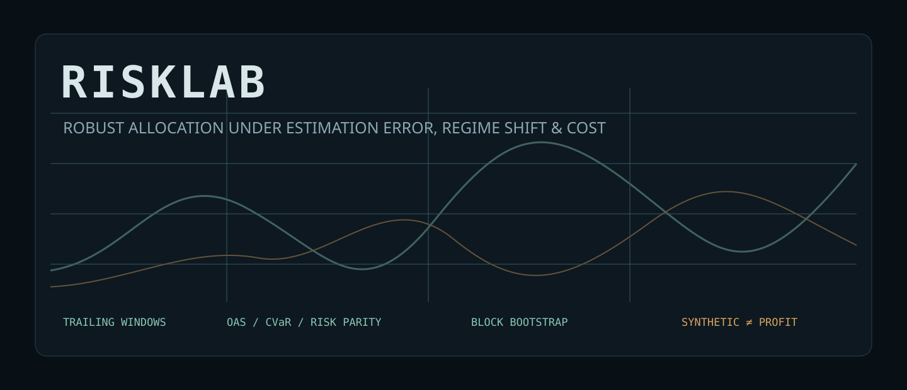
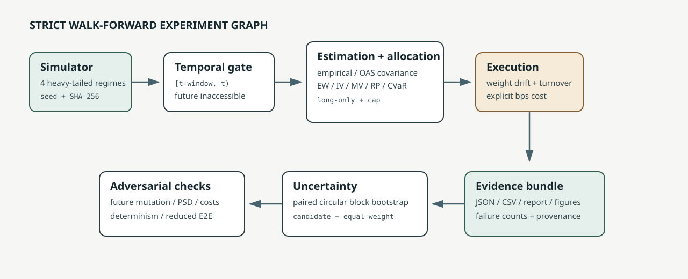

<p align="center">
  
</p>

# RiskLab

**A reproducible walk-forward laboratory for asking a harder question than “which portfolio won?”: which allocation rules remain defensible when covariance estimates are unstable, regimes change, and trading is not free?**

RiskLab implements the research core rather than wrapping a backtesting service. It contains six long-only allocation methods, a deterministic heavy-tailed market simulator, strict trailing-window evaluation, portfolio-weight drift, one-way turnover, explicit transaction costs, moving-block bootstrap uncertainty, numerical diagnostics, and a machine-readable evidence bundle.

> **Evidence boundary:** the included experiment uses synthetic data with known regimes. It measures algorithmic behavior under controlled stress; it is not historical performance, an investment recommendation, or evidence of live-trading profitability.

## What is technically interesting

- **Estimation risk:** empirical covariance is compared with an independently implemented Oracle Approximating Shrinkage estimator.
- **Constrained optimization:** minimum variance, equal-risk-contribution, and minimum-CVaR allocations are solved under long-only and concentration constraints.
- **Temporal integrity:** every rebalance at day `t` uses only `[t-window, t)` observations; tests mutate future observations to detect leakage.
- **Execution realism:** weights drift between rebalances, turnover is measured against pre-trade weights, and costs are deducted on rebalance days.
- **Uncertainty rather than leaderboard prose:** paired moving-block bootstrap intervals compare each method with equal weight while retaining local serial structure.
- **Failure visibility:** optimizer failures are counted and surfaced; they are never silently converted into successful results.

<p align="center">
  
</p>

## Methods

| Method | Core idea | Principal vulnerability |
|---|---|---|
| Equal weight | no estimated parameters | ignores risk heterogeneity |
| Inverse volatility | allocate inversely to marginal volatility | ignores correlations |
| Sample minimum variance | minimize `wᵀΣw` using empirical covariance | covariance instability |
| OAS minimum variance | shrink covariance toward a scaled identity | shrinkage target can be misspecified |
| Risk parity | equalize ex-ante risk contributions | non-convex numerical solve |
| Minimum CVaR | linear program over observed tail losses | scenario-window dependence |

## Reproduce

```bash
python3 -m venv .venv
source .venv/bin/activate
python3 -m pip install --requirement requirements-lock.txt
export PYTHONPATH=src
bash scripts/verify.sh
python3 -m risklab.cli run --output-dir evidence/final --bootstrap-resamples 500
```

The release package also retains the exact output produced by the final command. See [`evidence/final/report.md`](evidence/final/report.md) after generation.

## Retained controlled result

The final four-scenario run used 1,800 synthetic daily observations across eight assets and 500 paired moving-block resamples per candidate comparison. Every method produced negative realized returns on the deliberately adverse path; the evidence therefore emphasizes risk containment rather than a winner narrative.

| Base scenario | Ann. volatility | Maximum drawdown | One-way turnover | Optimizer failures |
|---|---:|---:|---:|---:|
| Equal weight | 16.12% | -68.55% | 1.25 | 0 |
| Sample minimum variance | 12.61% | -57.45% | 3.39 | 0 |
| OAS minimum variance | 12.62% | -57.39% | 3.44 | 0 |
| Minimum CVaR | 12.90% | -58.19% | 7.03 | 0 |

A shorter 126-day estimation window raised sample-minimum-variance turnover from 3.39 to 6.28, while OAS and empirical minimum variance remained nearly indistinguishable on this particular path. Those are findings about the retained simulation, not claims of market superiority. Inspect the complete metrics and intervals in [`evidence/final/report.md`](evidence/final/report.md).

## Verification surface

```bash
make test       # unit, numerical, temporal-integrity, and reduced E2E tests
make verify     # tests + deterministic rerun + compilation + secret scan
make experiment # full four-scenario experiment and evidence bundle
```

The full experiment is deterministic for the pinned environment and seed. Runtime and environment metadata remain in `results.json`; volatile fields are excluded when the verifier compares semantic outputs.

## Repository map

```text
src/risklab/       simulation, estimators, allocators, backtest, metrics, bootstrap
scripts/           clean verification entry point
tests/             numerical, invariant, leakage, and E2E checks
docs/              methodology, architecture, limitations, provenance, failures
assets/            maintainable project visuals
evidence/final/    generated report, JSON, CSV, and figures
```

## What failed during development

The first design recomputed dense allocation problems far more often than the research question required and made a 500k-event systems benchmark pattern leak into a numerical experiment. The design was corrected to rebalance at explicit policy intervals, cache only defensible state, and retain optimizer failure counts. The failure record is in [`docs/FAILURE_LOG.md`](docs/FAILURE_LOG.md).

## Limitations

The simulator is deliberately stylized; returns are not a calibrated model of any named market. The OAS implementation assumes observations are identically distributed inside each estimation window even though the experiment deliberately violates stationarity. CVaR scenarios are empirical window observations. There are no taxes, borrow constraints, market impact, corporate actions, or live execution. See [`docs/LIMITATIONS.md`](docs/LIMITATIONS.md).

## Safety and scope

RiskLab is research software. It does not connect to brokers, place orders, ingest private data, or make suitability determinations. See [`SECURITY.md`](SECURITY.md).

## License

MIT. Methodological sources and formulas are identified in [`docs/METHODOLOGY.md`](docs/METHODOLOGY.md).
